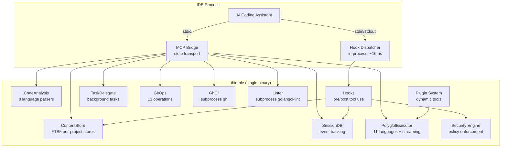
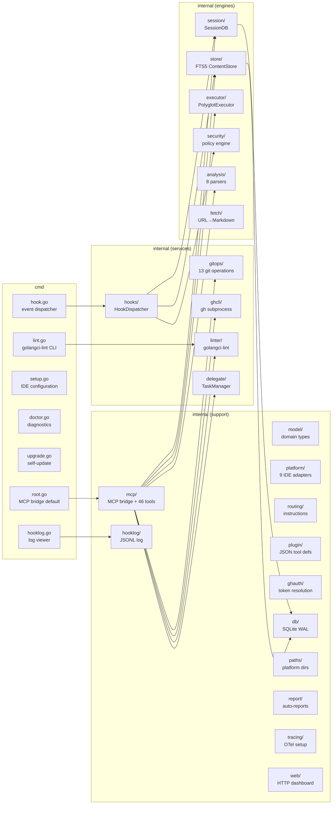
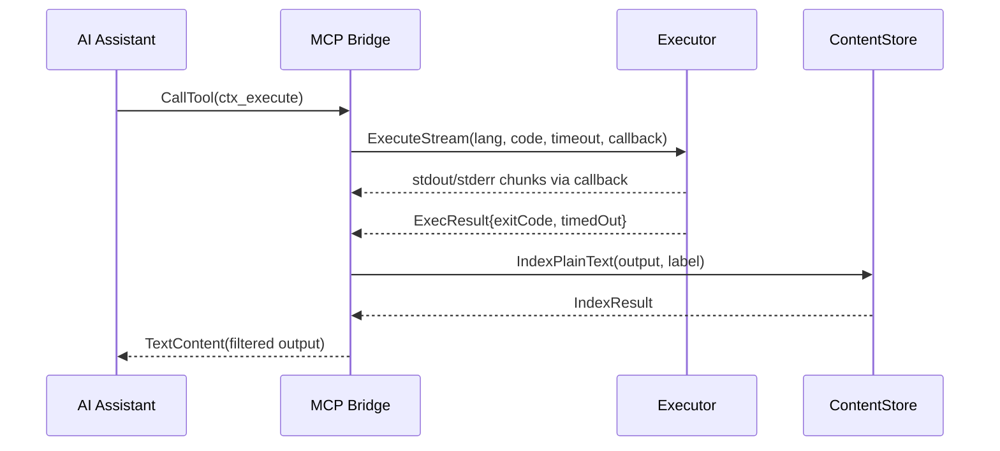
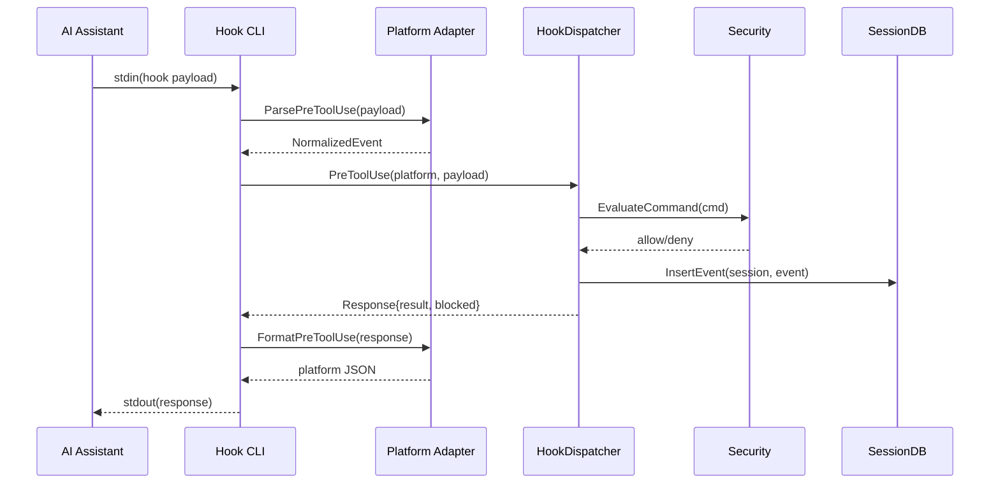
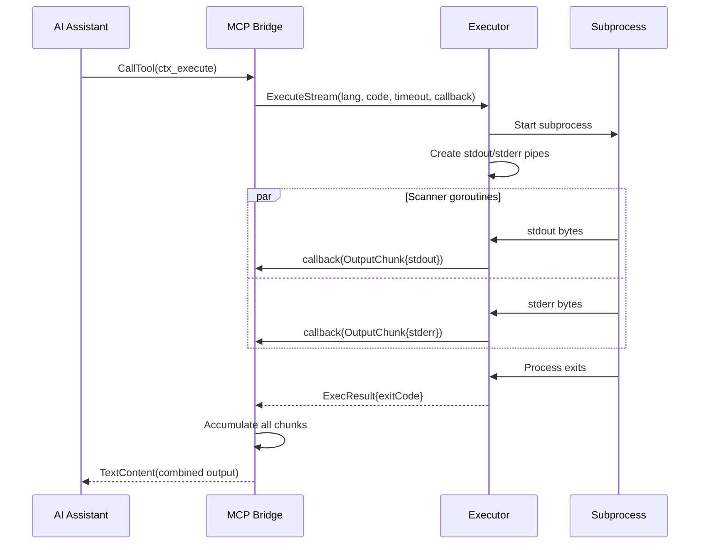
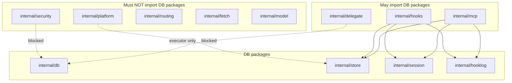

# Architecture

## Overview

Thimble is a single-binary MCP plugin. Every instance is standalone — no daemon, no gRPC, no discovery chain. The MCP bridge opens SQLite databases directly and calls service packages as in-process function calls.



## Component Diagram



## Data Flow

### MCP Tool Call



### Hook Event



### Streaming Executor



## Session Data Layout

```
{DataDir}/
├── sessions/
│   └── {16-char-sha256-digest}/    # per-project data
│       ├── content.db              # FTS5 knowledge base
│       ├── content.db-wal
│       ├── session.db              # session events + metadata
│       └── session.db-wal
├── plugins/                         # installed plugin definitions
├── hooklog.jsonl                    # hook interaction log
└── debug/                           # hook debug payloads

Platform-specific base:
├── Windows: %LOCALAPPDATA%\Thimble
├── macOS:   ~/Library/Application Support/thimble
└── Linux:   ~/.thimble
```

## Package Dependency Rules

Per ADR-0009, database access is allowed for service packages:



This rule is enforced by `TestDBAccessGuard` in `internal/importguard_test.go`.

## Platform-Specific Files

Build-constrained files across 3 packages:

| Package | Windows | Unix | Darwin |
|---------|---------|------|--------|
| `internal/paths` | `paths_windows.go` | `paths_unix.go` | `paths_darwin.go` |
| `internal/executor` | `proc_windows.go` | `proc_unix.go` | — |
| `cmd/thimble` | `upgrade_windows.go` | `upgrade_unix.go` | — |

## External CLI Dependencies

The `internal/ghcli` package invokes `gh` as an external subprocess. The `internal/linter` package invokes `golangci-lint` as an external subprocess. No build tags are needed for either. Token resolution for direct GitHub API access is handled by `internal/ghauth/` (reads `GH_TOKEN`, `GITHUB_TOKEN`, or `~/.config/gh/hosts.yml`).

## Platform Support

| Platform | Paradigm | Hook Events | Adapter |
|----------|----------|-------------|---------|
| Claude Code | JSON-stdio hooks | PreToolUse, PostToolUse, PreCompact, SessionStart | `claude_code.go` |
| Gemini CLI | JSON-stdio hooks | BeforeTool, AfterTool, PreCompress, SessionStart | `gemini_cli.go` |
| VS Code Copilot | JSON-stdio hooks | PreToolUse, PostToolUse, PreCompact, SessionStart | `vscode_copilot.go` |
| Cursor | JSON-stdio hooks | preToolUse, postToolUse | `cursor.go` |
| OpenCode | TS plugin | N/A (MCP only) | `opencode.go` |
| Codex | MCP only | N/A | `codex.go` |
| Kiro | JSON-stdio hooks | PreToolUse, PostToolUse | `kiro.go` |
| OpenClaw | JSON-stdio hooks | PreToolUse, PostToolUse, SessionStart | `openclaw.go` |
| Antigravity | JSON-stdio hooks | PreToolUse, PostToolUse | `antigravity.go` |
